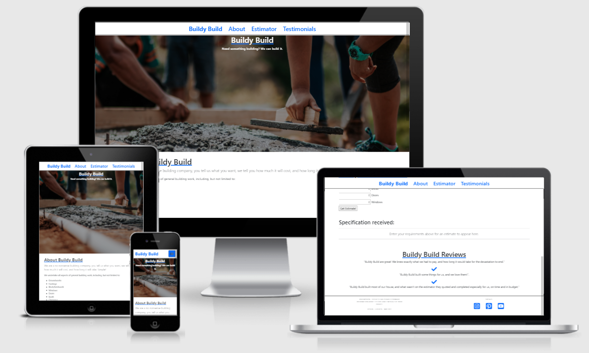

# **Buildy Build**

# Overview
A first project exploring PHP, learning the nature of the language and how to apply things.  The brief is a simple builders quoting tool which takes the number of items desired by a prospective client and returns an estimate of cost and time by category and in total.

Things to try:
* Variables - assignation and use
* Functions - defining and calling, getting information in to, and out of
* Loops
* Arrays
* Include
* Server side validation (incomplete as at 19/05/2021)

# Index
1. [UX](#ux)
1. [Features](#features)
    * [Existing Features](#existing-features)
    * [Features for Future Implementation](#features-for-future-implementation)
1. [Testing](#testing)
1. [Development Life Cycle](#development-life-cycle)
1. [Deployment](#deployment)
1. [Technologies Used](#technologies-used)
1. [Credits](#credits)
    * [Website](#website-credits)
    * [README](#readme-credits)

## UX: Overview and Broad Design Choices
The colours chosen were to reflect a simple, clean interface with the focus on content.  The specific choice of blue was to work with default link/Bootstrap colours as front end and css was not the focus of this project.  The project uses the Bootstrap default fonts for the same reason.

## Features

### **Existing Features**
* Fully responsive across device widths due to use of Bootstrap
* Semantic HTML should allow easy page navigation by screen readers
* Interactive calculator which generates results in page

### **Features for Future Implementation**
* Use server side validation rather than relying on browser for client side checks
* Scroll page to Results section when form posted
* Add form options for more categories
* Create further pages to better explore use of Include for common items

## Testing
Limited testing has been undertaken:
* All links work
* Collapse to tablet and mobile works as expected
* Client side validation ensures fields are completed and numerical - though these are vulnerable to misuse.
* External links open in a new tab

The following bugs or persistent issues were encountered and have been fixed:
* Each stage of development caused errors to display throughout the application.  In particular, errors shown before submission of the form were particularly difficult to eradicate.  This was overcome by including all code which used the posted user data inside functions and providing if statements to use nil values or not display at all if the form had not yet been submitted.
* Learning to pass data between functions without the use of global variables was particularly challenging, but a very useful insight into how to move away from the use of Global variables and the risks they pose.

## Development Life Cycle
The project was borne of the need to learn to use a new language, and as such very little thought or planning was utilised at any time.  Each concept was tried at a basic level and expanded upon, and the scope and content of the page grew and changed with the challenge at hand.

## Deployment
The website was created using [Atom](https://atom.io/). Version control was initially not used, but as the project grew this was undertaken by committing to [Git](https://git-scm.com/) and pushing to [GitHub](https://github.com/) using the functions within Atom.

[XAMPP](https://www.apachefriends.org/index.html) was used to create a local development environment and compile to code such that it could be previewed in browser.

### Cloning a Project into a Local IDE
1. Navigate to the [GitHub Repository](https://github.com/lilblupig/buildy-build).
1. Choose the Code dropdown menu, and copy the URL.

1. Open your local IDE and then open a terminal.
1. Set the current working directory to your preferred location for the cloned project.
1. Type in "git clone " followed by the copied URL. Be sure to include a space between git clone and the url, then press enter.
1. The cloned project will be created.

Additional downloads may well be required to compile and deploy the code.

You can find more information on cloning a repository from GitHub [here](https://docs.github.com/en/github/creating-cloning-and-archiving-repositories/cloning-a-repository).

## Technologies Used

### **Languages**
* HTML5 is used to provide the basic structure of the website.
  * About: [HTML5 Wiki](https://en.wikipedia.org/wiki/HTML5)
  * Creator: [W3 Consortium](https://www.w3.org/)
* CSS3 is used to provide most of the styling for the website.
  * About: [CSS3 Wiki](https://en.wikipedia.org/wiki/CSS)
  * Creator: [W3 Consortium](https://www.w3.org/)
* PHP is used to provide the interactive nature of such components throughout the website.
  * About: [PHP Home](https://www.php.net/)

### **Other Resources**
* [Bootstrap 5](https://getbootstrap.com/) is used to provide the grid functionality for uniform design, responsiveness and to enable the use of hamburger menu.
* [Font Awesome](https://fontawesome.com/) is used to provide the icons for the website.

### **Tools**
* [Git](https://git-scm.com/)/[GitHub](https://github.com/) was used for version control and repository storage.
* [Atom](https://atom.io/) was the IDE used to write the project.
* [Chrome Dev Tools](https://developers.google.com/web/tools/chrome-devtools) were used for specific responsiveness testing and drilling down into bug fixing.
* [Lighthouse](https://developers.google.com/web/tools/lighthouse) was used for macro testing and identification of errors for rectification.

## Credits

### **Website Credits**

#### Content
The content is 100% fabricated.

#### Media
* The photographs used for the website were obtained from [Pexels.com](https://www.pexels.com/):
[Hero Image](https://www.pexels.com/photo/selective-focus-photography-cement-2219024/) Photo by Rodolfo Quirós.

* The Favicon used for the website was obtained from [Flaticon](https://www.flaticon.com/authors/eucalyp) Icon made by Eucalyp.

#### Acknowledgements
Thank you in particular to:
* Shaun Dobie for direction with the language and project.

### **README Credits**

#### Content
Structure and content based heavily on:
* [Code Institute Solutions - README Template](https://github.com/Code-Institute-Solutions/readme-template)

#### Media
The images for this README are from the following sources:
* Snips taken from GitHub.
* [Am I Responsive](http://ami.responsivedesign.is/).

#### Other
* Markdown basic taken from [Mastering Markdown](https://guides.github.com/features/mastering-markdown/).

**This website was produced as an educational project.**

**Created by Amy Hacker.**

[Back to Top](#buildy-build)
